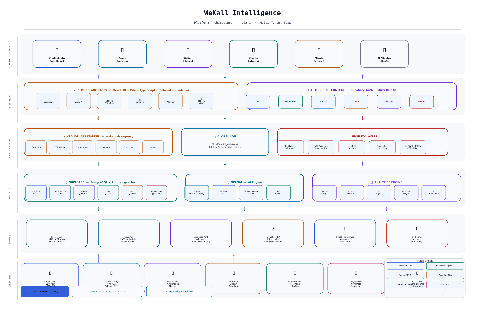

# WeKall Intelligence

> **Business Intelligence for CEOs & C-Suite**  
> Plataforma multi-tenant de inteligencia operativa para contact centers — datos reales, análisis en lenguaje natural, alertas proactivas.

**Producción:** https://wekall-intelligence.pages.dev  
**Versión actual:** V23 (Scale-A Fase 2)  
**Stack:** React 18 + TypeScript + Vite + Supabase + Cloudflare Pages/Workers  
**Proyecto:** WeIntelligence (anteriormente wekall-v9)

---

## Arquitectura de la Plataforma



> Diagrama completo de la arquitectura multi-tenant: capas de presentación, edge/seguridad, datos e IA, almacenamiento e ingesta. Versión V22.1 — Abril 2026.

---

## Descripción del Producto

WeKall Intelligence transforma los datos brutos del CDR (Call Detail Records) de un contact center en inteligencia ejecutiva accionable. El CEO y su C-Suite (VP Ventas, VP CX, COO) acceden en tiempo real a KPIs operativos, tendencias, alertas automáticas, análisis de grabaciones y consultas en lenguaje natural con Vicky Insights (IA sobre GPT-4o + RAG).

**Clientes activos:** `credismart` (CrediSmart/Crediminuto), `demo_empresa`, `wekall`  
**Modelo:** SaaS multi-tenant — un deployment, múltiples empresas aisladas por `client_id` y Supabase Auth

---

## Stack Completo

| Capa | Tecnología | Versión |
|------|-----------|---------|
| Frontend framework | React | 18.3.1 |
| Lenguaje | TypeScript | 5.8.3 |
| Build tool | Vite + SWC | 5.4.19 |
| UI components | shadcn/ui + Radix UI | latest |
| Styling | Tailwind CSS | 3.4.17 |
| Charts | Recharts | 2.15.4 |
| Router | React Router DOM | 6.30.1 |
| State/cache | TanStack React Query | 5.83.0 |
| Database | Supabase (PostgreSQL + pgvector) | @supabase/supabase-js 2.101.1 |
| AI Proxy | Cloudflare Workers | — |
| AI Models | GPT-4o / GPT-4o-mini / Whisper-1 | — |
| Embeddings | text-embedding-3-small | — |
| Diarización | pyannote/speaker-diarization-3.1 | Mac Mini |
| Deploy | Cloudflare Pages | — |
| Forms | React Hook Form + Zod | 7.61.1 / 3.25.76 |
| PDF | pdfjs-dist | 3.11.174 |
| Excel | xlsx (SheetJS) | 0.18.5 |
| Testing | Vitest + Playwright | 3.2.4 / 1.57.0 |

---

## Arquitectura del Sistema

```
┌─────────────────────────────────────────────────────────────────┐
│                    FRONTEND (Cloudflare Pages)                   │
│              https://wekall-intelligence.pages.dev               │
│                                                                  │
│  React 18 + TypeScript + Vite                                    │
│                                                                  │
│  ┌──────────────┐  ┌──────────────┐  ┌────────────────────────┐│
│  │  ClientContext│  │  RoleContext  │  │  TanStack React Query  ││
│  │  (multi-tenant│  │ (CEO/VP/COO) │  │  (cache + fetching)    ││
│  │   por client_id│ └──────────────┘  └────────────────────────┘│
│  └──────────────┘                                                │
│                                                                  │
│  Páginas: Overview · VickyInsights · Alertas · Equipos          │
│           Configuración · DocumentAnalysis · Login               │
└────────────────┬──────────────────────┬─────────────────────────┘
                 │                      │
                 ▼                      ▼
┌───────────────────────┐  ┌────────────────────────────────────┐
│   SUPABASE (Backend)  │  │   CLOUDFLARE WORKER (AI Proxy)     │
│                       │  │   wekall-vicky-proxy               │
│  PostgreSQL + pgvector│  │   .fabsaa98.workers.dev            │
│                       │  │                                    │
│  Tablas:              │  │  POST /chat  → GPT-4o              │
│  · cdr_daily_metrics  │  │  POST /transcribe → Whisper-1      │
│  · cdr_campaign_metrics│  │  POST /diarize → Mac Mini pyannote │
│  · cdr_hourly_metrics │  │  POST /ingest → Pipeline completo  │
│  · transcriptions     │  │  POST /rag-query → pgvector RAG    │
│  · agents_performance │  │  GET  /health                      │
│  · alert_log          │  │                                    │
│  · vicky_conversations│  │  [API Key OpenAI en CF Secrets]    │
│  · client_config      │  └────────────────┬───────────────────┘
│  · client_branding    │                   │
│  · app_users          │                   ▼
└───────────────────────┘  ┌────────────────────────────────────┐
                           │   MAC MINI (Diarización local)     │
                           │   pyannote puerto 8765             │
                           │   Cloudflare Tunnel → Worker       │
                           └────────────────────────────────────┘
```

---

## Funcionalidades Implementadas

### 📊 Overview (Dashboard Ejecutivo)
- Brief ejecutivo dinámico por rol (CEO / VP Ventas / VP CX / COO)
- KPIs en tiempo real desde Supabase: total llamadas, contactos efectivos, tasa de contacto %
- Sparklines de 7 y 30 días (llamadas + tasa de contacto)
- **Anomaly Detection:** banner proactivo cuando |hoy − media 30d| > 1.5 desviaciones estándar
- **Forecasting 7 días:** regresión lineal con banda de confianza ±1σ, botón "Analizar con Vicky"
- **Drill-down desde KPIs:** Sheet lateral con sparkline 30d, benchmarks y diagnóstico Vicky
- **Push proactivo dinámico:** insights generados en tiempo real desde `proactiveInsights.ts`
- BSC (Balanced Scorecard) — 4 perspectivas CEO
- Motor EBITDA: impacto en nómina, AHT, escenarios A/B/C

### 🤖 Vicky Insights (IA Conversacional)
- Chat en lenguaje natural con GPT-4o via Cloudflare Worker
- Function Calling: LLM decide el análisis, TypeScript ejecuta el cálculo
- **RAG con aislamiento por `client_id`:** búsqueda en transcripciones reales via pgvector — cada cliente solo ve sus propias transcripciones
- Input de voz: Whisper-1 via Worker → texto en chat (~$0.003/consulta)
- Decision Log: registro de decisiones con timestamp
- **Tab Historial:** últimas 20 conversaciones guardadas en Supabase, colapsables
- Multi-país: benchmarks Colombia / Perú / México
- Respuestas en prosa ejecutiva (post-procesamiento anti-markdown)
- PDF export con nombre de cliente dinámico

### 🎙️ Speech Analytics (`/speech-analytics`)
- 5 módulos de análisis sobre transcripciones reales:
  1. **Temas frecuentes** — ranking de temas mencionados
  2. **Sentimiento por agente** — score positivo/neutral/negativo
  3. **Resultados por campaña** — breakdown de outcomes
  4. **Frases de riesgo** — correlación con escalaciones
  5. **Duración vs resultado** — scatter AHT vs outcome

### 🚨 Alertas
- **Umbrales dinámicos por cliente:** leídos desde `client_config` (no hardcodeados)
- Columnas: `alert_tasa_critica`, `alert_tasa_warning`, `alert_delta_critico`, `alert_delta_warning`, `alert_volumen_minimo`
- Historial de las últimas 10 alertas con severidad (critical / warning / info)
- Almacenamiento en tabla `alert_log` Supabase

### 👥 Equipos
- 22 agentes × 30 días hábiles (660 registros en Supabase)
- **Áreas derivadas dinámicamente** de `agents_performance.area` — sin hardcodeo
- Indicador de tendencia: ↑ mejora / ↓ empeora / → estable (umbral ±3%)
- KPIs por agente: Tasa Contacto, Tasa Promesa, AHT, CSAT, FCR, Escalaciones

### 📄 Document Analysis
- Análisis inteligente de documentos con Vicky
- Soporte: Audio (MP3/WAV/M4A), PDF (hasta 20 páginas), Excel/CSV, Word (.docx), Imágenes
- Extracción en browser → GPT-4o via Worker → respuesta ejecutiva

### ⚙️ Configuración
- **Tab "Mi Empresa":** datos del cliente desde Supabase (`client_config` + `client_branding`)
- **Guardar cambios reales:** upsert en `client_branding` via Supabase
- Hotwords, integraciones, configuración de alertas por cliente

### 🔐 Autenticación Real (V20) — Endurecido en V21/V22
- **Supabase Auth v2:** `signInWithPassword`, `signOut`, `getSession`, `onAuthStateChange`
- **Login dual:** Supabase Auth real → fallback legacy (tabla `app_users`)
- **AuthGuard:** Solo permite acceso con sesión activa de Supabase Auth (fix V21)
- **3 capas de aislamiento completo (V22):** queries con `client_id` + RAG con `client_id_filter` + **RLS en Supabase (9 tablas)**
- Roles: CEO, VP Ventas, VP CX, COO, admin
- Credencial activa: `fabian@wekall.co` / `WeKall2026!`
- **Recuperación de contraseña (V22):** flujo nativo en `/forgot-password` y `/reset-password`

### 📡 Rutas de la Aplicación

| Ruta | Descripción |
|------|-------------|
| `/` → `/overview` | Dashboard ejecutivo con KPIs, forecasting, drill-down |
| `/vicky` | Chat IA con Vicky Insights |
| `/equipos` | Performance de agentes |
| `/document-analysis` | Análisis de documentos |
| `/configuracion` | Configuración del cliente |
| `/speech-analytics` | Análisis de grabaciones (5 módulos) |
| `/transcriptions` | Listado de transcripciones |
| `/transcriptions/:id` | Detalle de transcripción individual |
| `/upload` | Subida de grabaciones al pipeline |
| `/search` | Búsqueda semántica sobre transcripciones |
| `/login` | Autenticación |
| `/forgot-password` | **V22** — Solicitud de recuperación de contraseña |
| `/reset-password` | **V22** — Formulario de nueva contraseña con token |

---

## Variables de Entorno

### Frontend (`.env.local` / `.env.production`)

```env
# URL del Cloudflare Worker proxy (requerido para Vicky/IA)
VITE_PROXY_URL=https://wekall-vicky-proxy.fabsaa98.workers.dev
```

### Cloudflare Worker (Secrets via `wrangler secret put`)

```
OPENAI_API_KEY      → API key de OpenAI (gpt-4o, whisper-1, embeddings)
SUPABASE_URL        → https://iszodrpublcnsyvtgjcg.supabase.co
SUPABASE_ANON_KEY   → sb_publishable_eRRG-... (anon key de Supabase)
DIARIZATION_URL     → URL del Cloudflare Tunnel al Mac Mini (auto-actualiza)
```

### Scripts Python (`scripts/`)

```bash
export SUPABASE_SERVICE_KEY="eyJhbGciOiJIUzI1NiIsInR5cCI6..."  # service_role key
```

> **Nota de seguridad:** El `SUPABASE_ANON_KEY` es público (frontend). El `SUPABASE_SERVICE_KEY` (service_role) solo se usa en scripts de backend con acceso elevado — nunca en el frontend.

---

## Setup Local

### Prerequisitos

- Node.js ≥ 18 (recomendado v22)
- npm o bun
- Acceso a Supabase: https://iszodrpublcnsyvtgjcg.supabase.co

### Instalación

```bash
# Clonar el repo
git clone <repo-url>
cd wekall-v9

# Instalar dependencias
npm install
# o con bun:
bun install

# Configurar variables de entorno
cp .env.local.example .env.local
# Editar .env.local con la URL del worker
```

### Correr en desarrollo

```bash
npm run dev
# Disponible en http://localhost:8080
```

### Build y preview

```bash
npm run build
npm run preview
```

### Tests

```bash
npm run test          # Vitest (unit tests)
npm run test:watch    # Modo watch
npx playwright test   # E2E tests
```

---

## Deploy a Producción

### Cloudflare Pages (automático via GitHub)

El deploy se dispara automáticamente con cada push a `main`.

```bash
git add .
git commit -m "feat: descripción del cambio"
git push origin main
# Cloudflare Pages detecta el push y hace deploy en ~2 min
```

**Configuración en Cloudflare Pages:**
- Build command: `npm run build`
- Output directory: `dist`
- Environment variable: `VITE_PROXY_URL` = `https://wekall-vicky-proxy.fabsaa98.workers.dev`

### Deploy manual

```bash
npm run build
npx wrangler pages deploy dist --project-name wekall-intelligence
```

### Deploy del Cloudflare Worker

```bash
cd /Users/celeru/.openclaw/workspace/wekall-proxy
wrangler deploy
# Para actualizar secrets:
wrangler secret put OPENAI_API_KEY
```

---

## Estructura de Carpetas `src/`

```
src/
├── App.tsx                    # Router principal + AuthGuard + Providers
├── main.tsx                   # Entry point React
├── index.css                  # Estilos globales (Tailwind base)
├── App.css                    # Estilos específicos del app
│
├── pages/                     # Vistas principales (una por ruta)
│   ├── Overview.tsx           # Dashboard ejecutivo con KPIs y anomaly detection
│   ├── VickyInsights.tsx      # Chat IA + historial de conversaciones
│   ├── Alertas.tsx            # Sistema de alertas con historial Supabase
│   ├── Equipos.tsx            # Performance de agentes (datos reales Supabase)
│   ├── Configuracion.tsx      # Settings: empresa, hotwords, integraciones
│   ├── DocumentAnalysis.tsx   # Análisis de documentos con GPT-4o Vision
│   ├── Login.tsx              # Auth mock: email + company_code → app_users
│   └── NotFound.tsx           # Fallback 404
│
├── contexts/
│   ├── ClientContext.tsx      # Estado global del cliente activo (multi-tenant)
│   └── RoleContext.tsx        # Estado del rol activo (CEO/VP/COO/admin)
│
├── hooks/                     # Custom hooks con lógica de negocio
│   ├── useCDRData.ts          # KPIs principales desde cdr_daily_metrics
│   ├── useAgentsData.ts       # Performance de agentes desde agents_performance
│   ├── useAlerts.ts           # Gestión de alertas y evaluación de umbrales
│   ├── useAuditLogs.ts        # Historial de auditoría
│   ├── useChat.ts             # Lógica del chat con Vicky (Worker + streaming)
│   ├── useDashboard.ts        # Agregaciones para el dashboard
│   ├── useHotwords.ts         # Hotwords configurables
│   ├── useIntegrations.ts     # Estado de integraciones externas
│   └── useTranscriptions.ts   # Consulta de transcripciones
│
├── lib/
│   ├── supabase.ts            # Cliente Supabase + tipos + queries helper
│   ├── api.ts                 # Cliente HTTP para el Cloudflare Worker
│   ├── utils.ts               # Utilidades generales (cn, formatters)
│   └── vickyCalculations.ts   # Motor de cálculos EBITDA/KPI (Function Calling)
│
├── data/
│   ├── mockData.ts            # Datos de referencia y funciones de contexto CDR
│   └── benchmarks.ts          # Benchmarks multi-industria (8 verticales)
│
├── components/
│   ├── AppSidebar.tsx         # Navegación lateral con info del cliente
│   ├── KPICard.tsx            # Card de KPI con sparkline y delta
│   ├── KPICardCompact.tsx     # Versión compacta del KPICard
│   ├── ChatMessageBubble.tsx  # Burbuja de mensaje en el chat
│   ├── SearchBar.tsx          # Barra de búsqueda global
│   ├── SentimentBadge.tsx     # Badge de sentimiento (positivo/neutral/negativo)
│   ├── TranscriptBubble.tsx   # Vista de fragmento de transcripción
│   └── ui/                    # Componentes shadcn/ui (Radix primitivos)
│
├── layouts/
│   └── AppLayout.tsx          # Layout principal con sidebar y topbar
│
└── types/
    └── index.ts               # Tipos TypeScript compartidos
```

---

## Supabase: Tablas y Schema

### Proyecto
- **URL:** https://iszodrpublcnsyvtgjcg.supabase.co
- **Región:** São Paulo (latencia óptima para LATAM)
- **Plan:** Free tier (funcional para el volumen actual)

### Tablas principales

| Tabla | Propósito | Registros aprox. |
|-------|-----------|-----------------|
| `cdr_daily_metrics` | KPIs diarios agregados por operación | ~822 días × clientes |
| `cdr_campaign_metrics` | KPIs diarios por campaña | ~4 campañas × días |
| `cdr_hourly_metrics` | Distribución horaria de llamadas | ~24 horas × días |
| `transcriptions` | Transcripciones + embeddings pgvector | 50+ (piloto) |
| `agents_performance` | Performance diaria por agente | 660 registros (22×30) |
| `alert_log` | Historial de alertas disparadas | creciente |
| `vicky_conversations` | Q&A guardadas con Vicky | creciente |
| `client_config` | Configuración por cliente (multi-tenant) | 1 por cliente |
| `client_branding` | Branding por cliente (logo, colores) | 1 por cliente |
| `app_users` | Usuarios por empresa con roles | N por cliente |

### Hacer migraciones

Las migraciones se ejecutan manualmente en el **Supabase SQL Editor**:

1. Abrir https://supabase.com/dashboard/project/iszodrpublcnsyvtgjcg
2. Ir a **SQL Editor** en el menú izquierdo
3. Pegar el contenido del script SQL correspondiente
4. Clic en **Run**

Scripts disponibles en `scripts/`:
- `create_agents_table.sql` — crea tablas V18 (agents_performance, alert_log, vicky_conversations)
- `migrate_multitenant.sql` — migración V19 (client_id, app_users, client_branding)
- `setup_auth.sql` — **NUEVO V20** — auth_id en app_users, constraint UNIQUE(email,client_id), trigger, función get_user_client_id()
- `update_search_function.sql` — **NUEVO V20** — función search_transcriptions con parámetro client_id_filter

---

## Multi-Tenant: Onboarding de Nuevo Cliente

### Método rápido (recomendado)

```bash
export SUPABASE_SERVICE_KEY="eyJhbGciOiJIUzI1NiIsInR5cCI6..."

# V20: incluir --password para crear usuario con auth real
python3 scripts/onboard_client.py \
  --client-id empresa_xyz \
  --client-name "Empresa XYZ" \
  --industry "Contact Center" \
  --country "Colombia" \
  --email ceo@empresa.com \
  --name "Nombre CEO" \
  --role CEO \
  --password "ContraseñaSegura123!"
```

El script crea en un solo comando:
1. Registro en `client_config`
2. Registro en `client_branding`
3. Usuario en Supabase Auth (con contraseña real)
4. Registro vinculado en `app_users` (con `auth_id`)

### Crear usuario adicional (sin onboarding completo)

```bash
# Para un cliente ya existente, agregar solo un usuario con auth real:
python3 scripts/create_auth_user.py \
  --email vpventas@empresa.com \
  --password "ContraseñaSegura123!" \
  --client-id empresa_xyz \
  --name "VP de Ventas" \
  --role "VP Ventas"
```

### Cómo funciona el aislamiento

Cada tabla tiene columna `client_id TEXT`. Todas las queries del frontend incluyen `.eq('client_id', clientId)` donde `clientId` viene del `ClientContext` (persistido en localStorage).

**Estado actual:** Las RLS policies permiten lectura a `anon` sin restricción por `client_id` — el filtrado es a nivel de aplicación. La restricción real por `client_id` en RLS es parte del **Roadmap V20**.

---

## Cloudflare Worker: Rutas Disponibles

**Worker URL:** `https://wekall-vicky-proxy.fabsaa98.workers.dev`

| Ruta | Método | Descripción | Costo estimado |
|------|--------|-------------|----------------|
| `/health` | GET | Health check | Gratis |
| `/chat` o `/` | POST | Chat GPT-4o / GPT-4o-mini | ~$0.005–0.015/consulta |
| `/transcribe` | POST | Whisper-1 STT (FormData con audio) | $0.006/min (~$0.003/consulta 30s) |
| `/diarize` | POST | Diarización pyannote via Mac Mini | Gratis (local) |
| `/rag-query` | POST | RAG: embedding + pgvector + GPT-4o | ~$0.01/consulta |
| `/ingest` | POST | Pipeline: audio URL → Whisper → GPT → embed → Supabase | ~$0.02/llamada |

Ver documentación completa en [`docs/cloudflare-worker.md`](docs/cloudflare-worker.md).

---

## Seguridad — Arquitectura de Aislamiento Multi-Tenant (V22)

WeKall Intelligence implementa **3 capas de aislamiento** para garantizar que cada cliente solo vea sus propios datos:

### Capa 1 — Cloudflare Worker (Auth + Proxy AI)
- Todas las llamadas a OpenAI (chat, Whisper, embeddings, RAG) pasan por el Worker
- El Worker valida el `client_id` antes de procesar queries de RAG
- La API key de OpenAI **nunca** está expuesta en el frontend
- El `SUPABASE_SERVICE_KEY` tampoco está en el cliente — solo en CF Secrets

### Capa 2 — Frontend: `client_id` obligatorio en todas las queries
- `ClientContext` inicializa con el `client_id` del usuario autenticado
- Todas las queries Supabase incluyen `.eq('client_id', clientId)` — sin excepción
- `getRecentAlertLog()` y `getVickyHistory()` requieren `clientId` explícito (fix H-1)
- Eliminado fallback hardcodeado `'credismart'` en 6 funciones (fix H-2)
- RAG: Worker recibe `client_id` en cada `/rag-query` → `search_transcriptions` filtra por cliente

### Capa 3 — Supabase RLS (nivel base de datos) ✅ ACTIVO
- RLS habilitado en **9 tablas** de datos de negocio
- Policy: `USING (client_id = public.get_user_client_id())`
- Aislamiento garantizado incluso si el frontend tiene un bug

| Tabla con RLS | Estado |
|--------------|--------|
| `transcriptions` | 🔐 ACTIVO |
| `agents_performance` | 🔐 ACTIVO |
| `agent_daily_metrics` | 🔐 ACTIVO |
| `cdr_daily_metrics` | 🔐 ACTIVO |
| `client_config` | 🔐 ACTIVO |
| `client_branding` | 🔐 ACTIVO |
| `client_kpi_targets` | 🔐 ACTIVO |
| `client_labor_costs` | 🔐 ACTIVO |
| `vicky_conversations` | 🔐 ACTIVO |

---

## Infraestructura — Resiliencia del Mac Mini (V22)

| LaunchAgent | Función | Intervalo |
|-------------|---------|----------|
| `ai.openclaw.gateway.watchdog` | Detecta caída del gateway, reinicia automáticamente, alerta WhatsApp si falla 3 veces | Cada 5 min |
| `ai.openclaw.startup-recovery` | Levanta todos los servicios al reiniciar el Mac Mini | Al iniciar |

---

## Roadmap (Qué Falta)

### ✅ V20 — Auth Real (COMPLETADO)
- [x] Migrado a **Supabase Auth v2** (email/password) con login dual
- [x] RAG con `client_id_filter` — aislamiento validado
- [x] Umbrales de alerta dinámicos por cliente
- [x] Forecasting 7 días, drill-down, speech analytics, push proactivo

### ✅ V21 — Proxy 4G + Function Calling (COMPLETADO — 2026-04-07)
- [x] Proxy CF Worker para queries Supabase (fix red 4G Claro)
- [x] Function Calling dinámico en Vicky
- [x] Fix crítico: AuthGuard bypass localStorage eliminado

### ✅ V22 — Seguridad Multi-Tenant Completa + UX + Infraestructura (COMPLETADO — 2026-04-13)
- [x] RLS activado en 9 tablas con `get_user_client_id()`
- [x] H-1 fix: `clientId` obligatorio en funciones críticas
- [x] H-2 fix: eliminado fallback `'credismart'` en 6 funciones
- [x] Auditoría completa: 20 issues corregidos (2 CRITICAL, 3 HIGH, 12 MEDIUM, 3 LOW)
- [x] ForgotPassword y ResetPassword (flujo nativo)
- [x] ErrorBoundary en todas las rutas
- [x] Loading skeletons (PageSkeleton, CardSkeleton)
- [x] VickyChatHistory.tsx extraído de VickyInsights.tsx
- [x] Gateway watchdog + startup recovery

### V23 — Pipeline CDR Automático
- [ ] Script de carga CDR → Supabase (cron diario)
- [ ] Procesamiento del CSV de WeKall → `cdr_daily_metrics`
- [ ] Validación de datos y alertas de ingestión

### V24 — Notificaciones Proactivas
- [ ] Webhook de alertas → WhatsApp via wacli
- [ ] Alertas programadas (diarias/semanales) con resumen ejecutivo
- [ ] Integración con email (Microsoft Graph API)

### Deuda Técnica (post-V22)
- [ ] Tests unitarios (cobertura actual: mínima)
- [ ] Escalar RAG de 50 a 375 transcripciones (metodología COPC)

---

## Arquitectura de Decisiones Clave

| Decisión | Por qué |
|----------|---------|
| Supabase sobre Firebase | pgvector nativo para RAG, SQL estándar, región LATAM |
| Cloudflare Worker como proxy | API key de OpenAI nunca expuesta en frontend |
| Function Calling para cálculos | LLM interpreta, TypeScript calcula — resultados deterministas |
| multi-tenant por `client_id` en app | Más simple que múltiples proyectos Supabase; un solo deploy |
| Auth real Supabase Auth v2 (V20) | Login dual: auth real → fallback legacy; sin breaking changes |
| Mac Mini para diarización | CF Workers tiene límite 128MB RAM; pyannote necesita 2-4GB |

---

## Datos de Conexión

```typescript
// supabase.ts
const SUPABASE_URL = 'https://iszodrpublcnsyvtgjcg.supabase.co';
const SUPABASE_ANON_KEY = 'sb_publishable_eRRG-QSyURpWV-FstJUc4g_M-xmD6v_';
```

> Ver documentación detallada:
> - [`docs/supabase-schema.md`](docs/supabase-schema.md) — Schema completo tabla por tabla
> - [`docs/multi-tenant.md`](docs/multi-tenant.md) — Arquitectura multi-tenant
> - [`docs/cloudflare-worker.md`](docs/cloudflare-worker.md) — Worker rutas y deploy
> - [`scripts/README.md`](scripts/README.md) — Scripts de base de datos y onboarding
# Rebuild con env vars - Sat May  2 10:46:10 -05 2026
